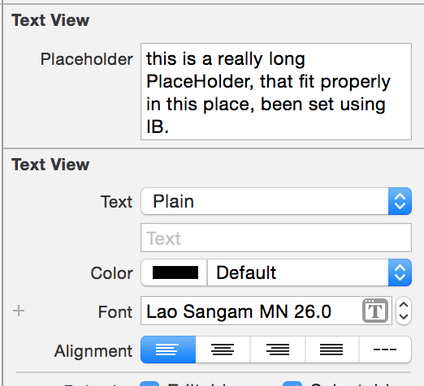

UITextView-Placeholder
======================

Easy way to add a placeholder text to UITextView from IB
  
you'll find a category holding this line
<pre>
@property (nonatomic, strong) IBInspectable NSString *placeholder;
</pre>
this do all the magic, so in IB you can find a field to set the placeholder text you want to use   

so here is the result.   

    
when the text change the placeholder is removed, and if the text is deleted the placeholder is back :)
